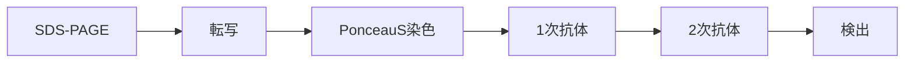

# ウエスタンブロッティング

## ワークフロー

Materials & Recipes

### SDS-PAGE

| Material          | Cat. No.        | Misc. |
| ----------------- | --------------- | ----- |
| サンプル          |                 |       |
| マーカー          | BDL#DM660       |       |
| ゲル              | DRC#NXV-378HP20 |       |
| 電気泳動装置      | DRC#XVE-0MPC    |       |
| 1x Running Buffer |                 |       |

#### 1x Running Buffer
| Reagent            | Volume  |
| ------------------ | ------- |
| 10x Running Buffer | 100 mL  |
| MilliQ water       | 900 mL  |
| Total              | 1000 mL |

#### 10x Running Buffer
| Reagent       | Volume |
| ------------- | ------ |
| Tris          | 30 g   |
| Glycine       | 144 g  |
| EDTA-2Na-2H2O | 7.5 g  |
| SDS           | 10 g   |
Fill up to 1000 mL with MilliQ water.

### 転写～Ponceau S染色
| Material          | Cat. No.            | Misc.               |
| ----------------- | ------------------- | ------------------- |
| 泳動したゲル      |                     |                     |
| PVDF膜            | Millipore#IPVH00010 | カットして使用      |
| ろ紙              | ADVANTEC#526        | カットして使用、2枚 |
| 転写装置          | DRC#XVE-0MPB        |                     |
| スポンジ          | DRC#XVE-MPPADHS     | 3(or4)個使用        |
| 1xTransfer Buffer |                     |                     |
| Methanol          | Nacalai#21915-93    |                     |
| Ponceau S染色液   | APRO#SP-4030        |                     |

#### 1x Transfer Buffer
| Reagent             | Volume  |
| ------------------- | ------- |
| 10x Transfer Buffer | 100 mL  |
| Methanol            | 100 mL  |
| MilliQ water        | 900 mL  |
| Total               | 1000 mL |

#### 10x Tranfer Buffer
| Reagent | Volume |
| ------- | ------ |
| Tris    | 30 g   |
| Glycine | 144 g  |
Fill up to 1000 mL with MilliQ water.

#### 0.1 N NaOH溶液
| Reagent | Volume |
| ------- | ------ |
| Tris    | 4 g    |
Fill up to 1000 mL with MilliQ water.

### ブロッキング～検出

| Material       | Cat. No.              | Misc.                    |
| -------------- | --------------------- | ------------------------ |
| 転写したPVDF膜 |                       |                          |
| TBS-T          |                       | 表記TBS'Tの場合もある    |
| 1次抗体        |                       | 検出したい抗原に合わせる |
| 1次抗体希釈液  | 自作orDRC#DRC-WSET250 |                          |
| 2次抗体        |                       | 1次抗体の宿主に合わせる  |
| 2次抗体希釈液  | 自作orDRC#DRC-WSET250 |                          |
| 化学発光反応液 | Thermo#34075等        |                          |

#### TBS-T
| Reagent  | Volume |
|----------|--------|
| 10x TBS  | 200 mL |
| Tween 20 | 1 mL   |
Fill up to 2000 mL with MilliQ water.

#### 10x TBS
| Reagent | Volume |
|---------|--------|
| NaCl    | 80 g   |
| KCl     | 2 g    |
| Tris    | 30 g   |
adjust pH to 7.4 with HCl, and fill up to 1000 mL with MilliQ water.

#### Mild-Stripping buffer
| Reagent  | Volume |
|----------|--------|
| Glycine  | 7.5 g  |
| SDS      | 0.5 g  |
| Tween 20 | 5 mL   |
adjust pH to 2.2 with HCl, and fill up to 500 mL with MilliQ water.

## Protocol

SDS-PAGE

- [ ] aaa
- [ ] bbb
- [x]ccc

転写

Ponceau S染色

ブロッキング

抗体処理

検出

(optional) ストリッピング

