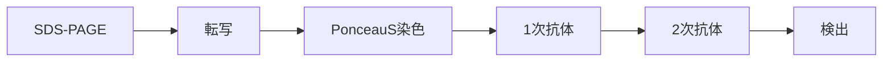

# ウエスタンブロッティング

## ワークフロー

## Materials & Recipes

### SDS-PAGE
| Material          | Cat. No.        | Misc. |
| ----------------- | --------------- | ----- |
| サンプル          |                 |       |
| マーカー          | BDL#DM660       |       |
| ゲル              | DRC#NXV-378HP20 |       |
| 電気泳動装置      | DRC#XVE-0MPC    |       |
| 1x Running Buffer |                 |       |

#### 1x Running Buffer
| Reagent            | Volume  |
| ------------------ | ------- |
| 10x Running Buffer | 100 mL  |
| MilliQ water       | 900 mL  |
| Total              | 1000 mL |

#### 10x Running Buffer
| Reagent       | Volume |
| ------------- | ------ |
| Tris          | 30 g   |
| Glycine       | 144 g  |
| EDTA-2Na-2H2O | 7.5 g  |
| SDS           | 10 g   |

Fill up to 1000 mL with MilliQ water.

### 転写～Ponceau S染色
| Material          | Cat. No.            | Misc.               |
| ----------------- | ------------------- | ------------------- |
| 泳動したゲル      |                     |                     |
| PVDF膜            | Millipore#IPVH00010 | カットして使用      |
| ろ紙              | ADVANTEC#526        | カットして使用、2枚 |
| 転写装置          | DRC#XVE-0MPB        |                     |
| スポンジ          | DRC#XVE-MPPADHS     | 3(or4)個使用        |
| 1xTransfer Buffer |                     |                     |
| Methanol          | Nacalai#21915-93    |                     |
| Ponceau S染色液   | APRO#SP-4030        |                     |

#### 1x Transfer Buffer
| Reagent             | Volume  |
| ------------------- | ------- |
| 10x Transfer Buffer | 100 mL  |
| Methanol            | 100 mL  |
| MilliQ water        | 900 mL  |
| Total               | 1000 mL |

#### 10x Tranfer Buffer
| Reagent | Volume |
| ------- | ------ |
| Tris    | 30 g   |
| Glycine | 144 g  |

Fill up to 1000 mL with MilliQ water.

#### 0.1 N NaOH溶液
| Reagent | Volume |
| ------- | ------ |
| Tris    | 4 g    |

Fill up to 1000 mL with MilliQ water.

### ブロッキング～検出
| Material       | Cat. No.              | Misc.                      |
| -------------- | --------------------- | -------------------------- |
| 転写したPVDF膜 |                       |                            |
| TBS-T          |                       | 表記TBS'Tの場合もある      |
| 1次抗体        |                       | 検出したい抗原に合わせる   |
| 1次抗体希釈液  | 自作orDRC#DRC-WSET250 |                            |
| 2次抗体        |                       | 1次抗体の宿主に合わせる    |
| 2次抗体希釈液  | 自作orDRC#DRC-WSET250 |                            |
| 化学発光反応液 | Thermo#34075等        | 発色液と呼ばれることもある |

#### TBS-T
| Reagent  | Volume |
| -------- | ------ |
| 10x TBS  | 200 mL |
| Tween 20 | 1 mL   |

Fill up to 2000 mL with MilliQ water.

#### 10x TBS
| Reagent | Volume |
| ------- | ------ |
| NaCl    | 80 g   |
| KCl     | 2 g    |
| Tris    | 30 g   |

adjust pH to 7.4 with HCl, and fill up to 1000 mL with MilliQ water.

#### 1次抗体希釈液
| Reagent         | Volume |
| --------------- | ------ |
| NaCl            | 1.46 g |
| KCl             | 0.1 g  |
| Na2HPO4         | 0.72 g |
| NaH2PO4         | 0.12 g |
| BSA             | 50 mg  |
| PEG6000(or8000) | 20 g   |
| Tween 20        | 500 μL |

#### 2次抗体希釈液
| Reagent         | Volume |
| --------------- | ------ |
| NaCl            | 8.77 g |
| KCl             | 0.1 g  |
| Na2HPO4         | 0.72 g |
| NaH2PO4         | 0.12 g |
| BSA             | 50 mg  |
| PEG6000(or8000) | 20 g   |
| Tween 20        | 500 μL |

#### Mild-Stripping buffer

| Reagent  | Volume |
| -------- | ------ |
| Glycine  | 7.5 g  |
| SDS      | 0.5 g  |
| Tween 20 | 5 mL   |

adjust pH to 2.2 with HCl, and fill up to 500 mL with MilliQ water.

## Protocol

### SDS-PAGE

- [ ] サンプル、マーカー、ダミーを準備する。サンプルはボルテックス、スピンダウンを行っておく。
- [ ] 冷蔵庫からゲルを取り出し、開封する
- [ ] ゲルを電気泳動装置にセットする。コームがある面を内側に向ける
- [ ] (ゲルが2枚ある場合は2枚セット。1枚の場合、ダミープレートを反対側にセットする)
- [ ] ネジを縦にする
- [ ] くさび（スーパーウェッジ）を挿入する
- [ ] 1x Running Bufferを中央部から注ぐ
- [ ] ゲル板の底が浸かった程度まで注いだのち、泳動装置を傾けてゲル板底の気泡を取り除く
- [ ] 電気泳動装置の上の方の線があるところまで1x Running Bufferを中央部から注ぐ。
- [ ] ゲル板からコームを取り外す
- [ ] マーカー2~5 μL、サンプル < 10 μLをゲル中の各wellにアプライする。
備考：サンプルは10 - 20 μgが推奨だが、少なくても検出は可能なことが多い。
- [ ] ふたをセットする
- [ ] 300V, 15 min電気泳動を行う
- [ ] 電気泳動終了後、ゲルを取り出す→転写へ

### 転写

- [ ] ゲルの上端、下端、左端、右端をヘラで除去する。
- [ ] ゲルの右上をカットし、上下左右の目安にする
- [ ] ゲルと同じサイズにろ紙、PVDF膜をカットする
- [ ] PVDF膜の左上をカットする
- [ ] ゲルを1x Transfer Bufferが入ったタッパーに移す
- [ ] PVDF膜をメタノールが入ったタッパーに移し、10秒弱浸漬する（親水化処理）。
- [ ] PVDF膜を1x Transfer Bufferが入ったタッパーに移す
- [ ] 10分インキュベートする（シーソー上で）
- [ ] スポンジを1x Transfer Bufferに浸漬する
- [ ] 転写装置の平べったい方にスポンジを１つセットする
- [ ] ろ紙を1x Transfer Bufferに浸漬し、スポンジの上に乗せる
- [ ] 1x Transfer Bufferをろ紙の上に少しかける
備考：以降、転写装置を組み上げるまで気泡が入らないようにする
- [ ] PVDF膜を左上に欠けがあるように乗せる
- [ ] 1x Transfer BufferをPVDF膜の上に少しかける
- [ ] ゲルを左上に欠けがあるように乗せる
- [ ] 1x Transfer Bufferをゲルの上に少しかける
- [ ] ろ紙を1x Transfer Bufferに浸漬し、スポンジの上に乗せる
- [ ] スポンジを1x Transfer Bufferに浸漬する
- [ ] 転写装置のくぼみがある方にスポンジを２個セットする
- [ ] 転写装置を組み立てる
- [ ] ケースに1x Transfer Bufferを半分程度入れる
- [ ] 転写装置をケースに入れる
- [ ] くさび（スーパーウェッジ）を挿入する
- [ ] 1x Transfer Bufferを線より少し上まで（上から見て、スポンジが浸かり切るまで）入れる
- [ ] ふたをセットする
- [ ] 225 mA, 12 min転写を行う
備考：230 mA, 13 minで行っている人も多い
- [ ] この間にブロッキング液（4% milkの場合：10 mL TBS-T + 0.4 g スキムミルク）を新しいタッパーに作っておく
- [ ] 転写終了後、PVDF膜を取り出す→Ponceau S染色へ

### Ponceau S染色

- [ ] 転写終了直後のPVDF膜をPonceau S染色液が入ったタッパーにうつす
- [ ] 5 minシーソーでインキュベート
- [ ] MilliQ水で洗浄する
- [ ] バンドをカメラで撮影する
- [ ] 0.1 N NaOHでバンドが消えるまで洗浄する
- [ ] MilliQ水で洗浄する→ブロッキングへ

### ブロッキング

- [ ] PVDF膜を左上に欠けがある向きでブロッキング液にうつす
- [ ] 1 hシーソーでインキュベート

### 抗体処理

- [ ] 1次抗体を希釈する。抗体希釈倍率はマニュアル等参考。
細長いPVDF膜の場合、3 mL抗体希釈液 + 抗体を添加する。膜全体の場合、5-6 mL程度必要。
- [ ] カットが必要なら、PVDF膜をカットする。カットした膜にも切り欠きを入れておく。
- [ ] PVDF膜を抗体希釈液にうつす
- [ ] 1 hシーソーでインキュベート
備考：Overnightする場合、ここで止めるのが推奨される
- [ ] MilliQ水で軽く洗浄。3回行う
- [ ] TBS-Tを適量入れる
- [ ] 5 minシーソーでインキュベート
- [ ] 2次抗体を希釈する。抗体希釈倍率はマニュアル等参考。
- [ ] 1 hシーソーでインキュベート
- [ ] MilliQ水で軽く洗浄。3回行う
- [ ] TBS-Tを適量入れる→検出へ

### 検出

- [ ] AI600にUSBメモリを接続する
- [ ] AI600の電源をONにする
- [ ] 化学発光反応液２つを混合する
- [ ] PVDF膜を反応液にうつし、1-5 minインキュベートする
- [ ] キムワイプ等でPVDF膜の端の余分な反応液を吸い取り、フィルムに乗せる
- [ ] フィルムをAI600のトレーに乗せる
- [ ] 撮影を行う。
備考：撮影条件は人によりけりだが、incremental + manual(オーバーレイ用)で撮っておくと後処理が楽
- [ ] データをセーブする
- [ ] 必要に応じて、画像解析を行う
- [ ] AI600の電源を落とす
- [ ] USBメモリを取り外す 

### (optional) ストリッピング

備考：同じ膜で他の抗体で検出を行いたい場合に、最初に用いた抗体を剥がす
- [ ] 検出後のPVDF膜をMild-Stripping bufferが入ったタッパーにうつす
- [ ] 10 minシーソーでインキュベート
- [ ] Bufferを捨て、新しいMild-Stripping bufferを入れる
- [ ] 10 minシーソーでインキュベート
備考：これでも前の抗体が検出されてしまう場合は、15% H2O2で1５ min処理するとシグナルが低下することがある
- [ ] Bufferを捨て、TBS-Tを入れる
- [ ] 5 minシーソーでインキュベート
- [ ] Bufferを捨て、TBS-Tを入れる
- [ ] 5 minシーソーでインキュベート
- [ ] →1次抗体処理 or ブロッキングへ
